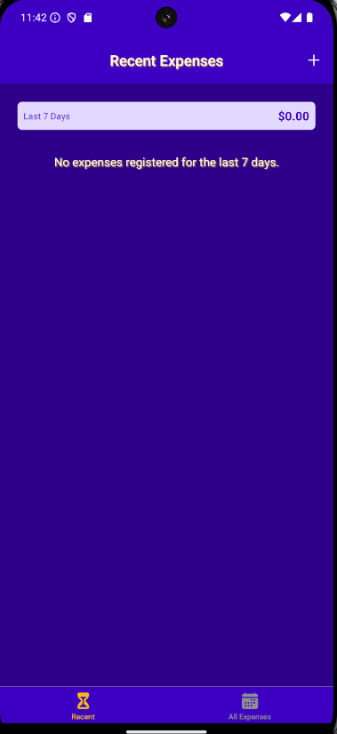
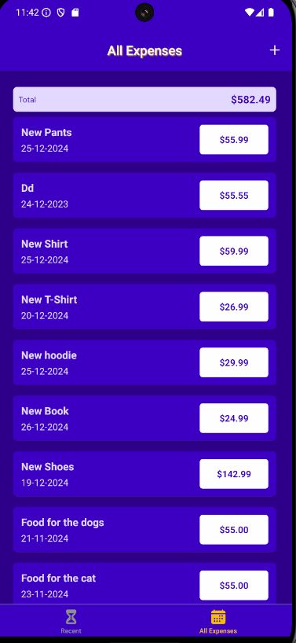
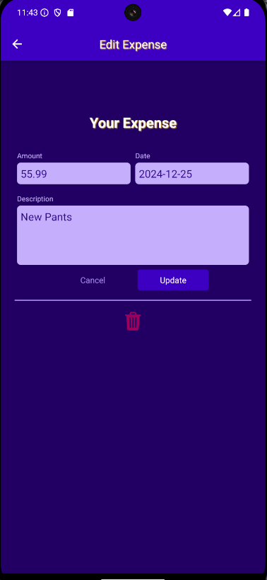

# Expense-Tracker-App-RN







Expense Tracker is an mobile application which allows the user to create records of expenses, offering users a seamless expense tracking experience.


## Features

- 🛍️ **Recent Expenses Catalog**: Shows the expenses made in the last 7 days.
- 🔍 **All Expenses**: Shows all the records made for expenses.
- 🛒 **CRUD Expenses**: Add, remove, update expense.
- 📱 **Responsive Design**: Optimized for all devices

## Technologies Used

### Frontend
- React.js
- React Native
- Redux
- ContextAPI
- Expo Vector Icons
- React Navigation-Native
- React Navigation-Bottom Tabs

### Backend
- Dummy Backend Firebase
- Dummy DB Firebase


### Other Tools
- Git/GitHub
- Expo
- Axios

## Installation Client

1. Clone the repository:
   ```bash
   git clone https://github.com/superGemHere/Expense-Tracker-App-RN.git
   ```
2. Navigate to the client directory:
   ```bash
   cd ExpenseTracker
   ```
3. Install dependencies:
   ```bash
   npm install
   ```
4. Set up environment variables:
   ```
     BACKEND_URL=your_backend_url 
   ```
5. Start the development server:
   ```bash
   npm start
   ```

### Prerequisites

1. Install Android for Android Emulator SDK (ADK) 
2. Configure Android Emulator trough Android Studio or another(BlueStacks). 
3. Install Xcode for iOS Emulator 
4. Good to go! 
